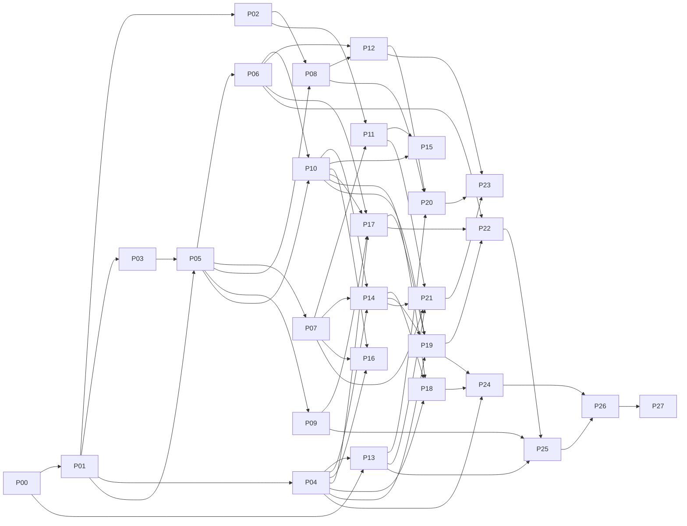

# PRP-MASTER: NeuroSphere build orchestration

> **This is the file you kick off from.** It sequences PRP-00 to PRP-27, carries the
> decisions that bind all of them, and defines what "the whole thing is done" means.
> Individual PRPs live in `PRPs/backlog/`; run one per session with
> `/prp:prp-execute PRPs/backlog/<file>.md`. The binding preamble is `PRP.md` §1–§3.

## Current status (read this first)

A fresh session starts here. The repository hygiene baseline (hooks, CI, kit
onboarding, emulator compose, ADRs) was done on 2026-10-08 outside the PRP flow.

The table below is **generated from the `PRPs/` directories**: `backlog/`,
`active/` and `shipped/` are the status. `/prp:prp-execute` moves the file; the
pre-commit hook regenerates this table whenever a `PRPs/` file is staged, and
`scripts/validate_planning.py` (CI) fails if it is stale. To refresh by hand:
`python scripts/prp_status.py --write`.

<!-- prp-status:begin -->
_Generated by `python scripts/prp_status.py --write` on 2026-10-10; do not edit by hand. The directory each file sits in is the status._

Shipped 2 · Active 0 · Backlog 26 of 28. **Next ready: PRP-02 capability-matrix-and-feasibility-benchmark** (wave W2).

| PRP | Status | Wave | Depends on | Ready | Model | Review | Note |
|---|---|---|---|---|---|---|---|
| [PRP-00](shipped/PRP-00-toolchain-workspaces-and-gates.md) toolchain-workspaces-and-gates | shipped | W0 | none | done | sonnet | required |  |
| [PRP-01](shipped/PRP-01-contracts-and-schemas.md) contracts-and-schemas | shipped | W1 | PRP-00 | done | opus | required |  |
| [PRP-02](backlog/PRP-02-capability-matrix-and-feasibility-benchmark.md) capability-matrix-and-feasibility-benchmark | backlog | W2 | PRP-01 | **yes** | sonnet | required | START HERE |
| [PRP-03](backlog/PRP-03-local-dev-environment-and-sandbox-generator.md) local-dev-environment-and-sandbox-generator | backlog | W2 | PRP-01 | **yes** | sonnet | none |  |
| [PRP-04](backlog/PRP-04-frontend-shell-design-system-auth.md) frontend-shell-design-system-auth | backlog | W2 | PRP-01 | **yes** | sonnet | none |  |
| [PRP-05](backlog/PRP-05-api-worker-runtime-and-self-observability.md) api-worker-runtime-and-self-observability | backlog | W3 | PRP-01, PRP-03 | blocked by PRP-03 | sonnet | none |  |
| [PRP-06](backlog/PRP-06-identity-authz-and-audit.md) identity-authz-and-audit | backlog | W4 | PRP-05 | blocked by PRP-05 | opus | required |  |
| [PRP-07](backlog/PRP-07-telemetry-ingestion-and-cost-ledger.md) telemetry-ingestion-and-cost-ledger | backlog | W4 | PRP-01, PRP-05 | blocked by PRP-05 | sonnet | required |  |
| [PRP-08](backlog/PRP-08-deployment-intelligence-and-iac.md) deployment-intelligence-and-iac | backlog | W4 | PRP-02, PRP-05 | blocked by PRP-02, PRP-05 | sonnet | required |  |
| [PRP-09](backlog/PRP-09-connector-sdk-and-reference-connectors.md) connector-sdk-and-reference-connectors | backlog | W4 | PRP-01, PRP-05 | blocked by PRP-05 | sonnet | required |  |
| [PRP-10](backlog/PRP-10-catalog-and-relationship-governance.md) catalog-and-relationship-governance | backlog | W5 | PRP-05, PRP-06 | blocked by PRP-05, PRP-06 | sonnet | required | manual: G03 live gate |
| [PRP-11](backlog/PRP-11-analytics-adapters.md) analytics-adapters | backlog | W5 | PRP-02, PRP-07 | blocked by PRP-02, PRP-07 | sonnet | required |  |
| [PRP-12](backlog/PRP-12-threat-model-and-security-baseline.md) threat-model-and-security-baseline | backlog | W5 | PRP-05, PRP-06, PRP-08 | blocked by PRP-05, PRP-06, PRP-08 | opus | required |  |
| [PRP-13](backlog/PRP-13-release-versioning-and-container-publishing.md) release-versioning-and-container-publishing | backlog | W5 | PRP-00, PRP-04, PRP-05 | blocked by PRP-04, PRP-05 | sonnet | none |  |
| [PRP-14](backlog/PRP-14-dashboards-cost-latency-coverage.md) dashboards-cost-latency-coverage | backlog | W6 | PRP-04, PRP-07, PRP-10 | blocked by PRP-04, PRP-07, PRP-10 | sonnet | none |  |
| [PRP-15](backlog/PRP-15-recommendations-engine.md) recommendations-engine | backlog | W6 | PRP-10, PRP-11 | blocked by PRP-10, PRP-11 | sonnet | none |  |
| [PRP-16](backlog/PRP-16-agent-evaluation-and-quality.md) agent-evaluation-and-quality | backlog | W6 | PRP-04, PRP-07, PRP-10 | blocked by PRP-04, PRP-07, PRP-10 | sonnet | required |  |
| [PRP-17](backlog/PRP-17-action-executor-and-hitl.md) action-executor-and-hitl | backlog | W6 | PRP-04, PRP-06, PRP-09, PRP-10 | blocked by PRP-04, PRP-06, PRP-09, PRP-10 | opus | required |  |
| [PRP-18](backlog/PRP-18-live-map-and-session-replay.md) live-map-and-session-replay | backlog | W7 | PRP-04, PRP-10, PRP-14 | blocked by PRP-04, PRP-10, PRP-14 | sonnet | required |  |
| [PRP-19](backlog/PRP-19-copilot-and-report-creation.md) copilot-and-report-creation | backlog | W7 | PRP-04, PRP-10, PRP-14, PRP-17 | blocked by PRP-04, PRP-10, PRP-14, PRP-17 | sonnet | required |  |
| [PRP-20](backlog/PRP-20-government-verification-and-sovereign-deployment.md) government-verification-and-sovereign-deployment | backlog | W7 | PRP-08, PRP-12, PRP-13 | blocked by PRP-08, PRP-12, PRP-13 | sonnet | required |  |
| [PRP-21](backlog/PRP-21-scale-federation-finops-and-dr.md) scale-federation-finops-and-dr | backlog | W7 | PRP-07, PRP-11, PRP-13, PRP-14 | blocked by PRP-07, PRP-11, PRP-13, PRP-14 | sonnet | none |  |
| [PRP-22](backlog/PRP-22-mcp-server-and-client.md) mcp-server-and-client | backlog | W8 | PRP-06, PRP-17, PRP-19 | blocked by PRP-06, PRP-17, PRP-19 | opus | required |  |
| [PRP-23](backlog/PRP-23-ato-evidence-and-data-lifecycle.md) ato-evidence-and-data-lifecycle | backlog | W8 | PRP-12, PRP-20, PRP-21 | blocked by PRP-12, PRP-20, PRP-21 | sonnet | required |  |
| [PRP-24](backlog/PRP-24-themes-sandbox-mode-and-accessibility.md) themes-sandbox-mode-and-accessibility | backlog | W8 | PRP-03, PRP-04, PRP-18, PRP-19 | blocked by PRP-03, PRP-04, PRP-18, PRP-19 | sonnet | none |  |
| [PRP-25](backlog/PRP-25-docs-site-and-public-assistant.md) docs-site-and-public-assistant | backlog | W9 | PRP-09, PRP-13, PRP-22 | blocked by PRP-09, PRP-13, PRP-22 | sonnet | none |  |
| [PRP-26](backlog/PRP-26-sales-and-marketing-deliverables.md) sales-and-marketing-deliverables | backlog | W9 | PRP-24, PRP-25 | blocked by PRP-24, PRP-25 | sonnet | required |  |
| [PRP-27](backlog/PRP-27-explainer-video-render.md) explainer-video-render | backlog | W10 | PRP-26 | blocked by PRP-26 | sonnet | none | manual: budget approval |
<!-- prp-status:end -->

### Preflight (run before spawning anything)

```bash
# 1. Gates green on a clean tree. Empty required gate = FAIL by design.
powershell -NoProfile -ExecutionPolicy Bypass -File ~/.claude/hooks/verify-gates.ps1 -Mode full

# 2. Planning alignment (also enforces PRP index coverage and no '|| true' in CI).
python scripts/validate_planning.py

# 3. Emulators healthy; no outbound calls. Needed from PRP-03 onward.
docker compose up -d --wait

# 4. Repo is private (decision D1).
gh repo view --json isPrivate

# 5. Only when a live gate is about to run, and only after operator approval:
#    az account show   &&   export NS_LIVE_APPROVED=1
```

Expected: gates PASS (build reported SKIP until PRP-00 item 2 makes it required),
validator PASS, three healthy containers, `"isPrivate": true`.

## Execution order and waves

WIP limit is 4 parallel sessions. A PRP starts only when every PRP it depends on is
in `PRPs/shipped/`. Phase gates sit between waves and need operator sign-off.

| Wave | PRPs (parallel) | Gate before the next wave |
|---|---|---|
| W0 | 00 | gates green on the real workspace; diagram render script and CI check keep G10 closed |
| W1 | 01 | contracts reviewed (Opus, `review: required`) |
| W2 | 02, 03, 04 | none |
| W3 | 05 | **Phase 0 exit**: contracts reviewed, emulator benchmark evidence filed under `docs/evidence/G03/` (decision D9), capability matrix fixture tests pass, operator approval before any paid or cloud work |
| W4 | 06, 07, 08, 09 | none |
| W5 | 10, 11, 12, 13 | PRP-10 cannot merge until the **G03 live benchmark** ran with operator approval |
| W6 | 14, 15, 16, 17 | **Phase 1 exit**: synthetic vertical slice (PRP-14 e2e) passes; one authorized live connector pilot (PRP-09) has measured freshness, or is recorded OPEN |
| W7 | 18, 19, 20, 21 | none |
| W8 | 22, 23, 24 | **Phase 3 exit**: failure/revocation/action-injection suites pass (PRP-17, PRP-19, PRP-22) |
| W9 | 25, 26 | none |
| W10 | 27 | explicit budget approval recorded in `marketing/video/APPROVAL.md` |



## PRP register

Model: `sonnet` by default; `opus` where the work defines contracts or security
boundaries that everything else inherits. Every PRP gets a Haiku verify pass for
gate output. `review: required` means one independent reviewer pass, approve
unless a blocking defect exists.

| ID | File | Phase | NS | Absorbs (v1.1) | Model | Review | Depends on | Wave |
|---|---|---|---|---|---|---|---|---|
| PRP-00 | `backlog/PRP-00-toolchain-workspaces-and-gates.md` | 0 | 07, 08, 10 | P0.3 remainder, G08, G10 | sonnet | required | none | W0 |
| PRP-01 | `backlog/PRP-01-contracts-and-schemas.md` | 0 | all | P0.2 contracts | **opus** | required | 00 | W1 |
| PRP-02 | `backlog/PRP-02-capability-matrix-and-feasibility-benchmark.md` | 0 | 07, 08 | P0.1, P0.2 benchmark, G01, G03 | sonnet | required | 01 | W2 |
| PRP-03 | `backlog/PRP-03-local-dev-environment-and-sandbox-generator.md` | 0 | 10 | new | sonnet | none | 01 | W2 |
| PRP-04 | `backlog/PRP-04-frontend-shell-design-system-auth.md` | 0/1 | 08, 10 | new | sonnet | none | 01 | W2 |
| PRP-05 | `backlog/PRP-05-api-worker-runtime-and-self-observability.md` | 0/1 | 08 | new | sonnet | none | 01, 03 | W3 |
| PRP-06 | `backlog/PRP-06-identity-authz-and-audit.md` | 1 | 08 | P1.3 | **opus** | required | 05 | W4 |
| PRP-07 | `backlog/PRP-07-telemetry-ingestion-and-cost-ledger.md` | 1 | 01 | P1.1 | sonnet | required | 01, 05 | W4 |
| PRP-08 | `backlog/PRP-08-deployment-intelligence-and-iac.md` | 1 | 07 | P1.4 reuse/IaC | sonnet | required | 02, 05 | W4 |
| PRP-09 | `backlog/PRP-09-connector-sdk-and-reference-connectors.md` | 2 | 01, 09 | P2.2 | sonnet | required | 01, 05 | W4 |
| PRP-10 | `backlog/PRP-10-catalog-and-relationship-governance.md` | 1 | 02 | P1.2 | sonnet | required | 05, 06, G03 live | W5 |
| PRP-11 | `backlog/PRP-11-analytics-adapters.md` | 2 | 01, 07 | P2.1 | sonnet | required | 02, 07 | W5 |
| PRP-12 | `backlog/PRP-12-threat-model-and-security-baseline.md` | 1 | 08 | new | **opus** | required | 05, 06, 08 | W5 |
| PRP-13 | `backlog/PRP-13-release-versioning-and-container-publishing.md` | 1 | 10 | new | sonnet | none | 00, 04, 05 | W5 |
| PRP-14 | `backlog/PRP-14-dashboards-cost-latency-coverage.md` | 1 | 01, 07 | P1.4 dashboards | sonnet | none | 04, 07, 10 | W6 |
| PRP-15 | `backlog/PRP-15-recommendations-engine.md` | 2 | 03 | P2.3 | sonnet | none | 10, 11 | W6 |
| PRP-16 | `backlog/PRP-16-agent-evaluation-and-quality.md` | 2 | 03 | P2.4 | sonnet | required | 04, 07, 10 | W6 |
| PRP-17 | `backlog/PRP-17-action-executor-and-hitl.md` | 3 | 04, 06 | P3.2 + P3.4, G05 | **opus** | required | 04, 06, 09, 10 | W6 |
| PRP-18 | `backlog/PRP-18-live-map-and-session-replay.md` | 3 | 05 | P3.1 | sonnet | required | 04, 10, 14 | W7 |
| PRP-19 | `backlog/PRP-19-copilot-and-report-creation.md` | 3 | 06 | P3.3 | sonnet | required | 04, 10, 14, 17 | W7 |
| PRP-20 | `backlog/PRP-20-government-verification-and-sovereign-deployment.md` | 4 | 07, 08 | P4.1 + P4.2, G02 | sonnet | required | 08, 12, 13 | W7 |
| PRP-21 | `backlog/PRP-21-scale-federation-finops-and-dr.md` | 4 | 07, 08 | P4.3 + P4.4, G07 | sonnet | none | 07, 11, 13, 14 | W7 |
| PRP-22 | `backlog/PRP-22-mcp-server-and-client.md` | 3 | 09 | P3.5 | **opus** | required | 06, 17, 19 | W8 |
| PRP-23 | `backlog/PRP-23-ato-evidence-and-data-lifecycle.md` | 4 | 08 | P4.5, G06 | sonnet | required | 12, 20, 21 | W8 |
| PRP-24 | `backlog/PRP-24-themes-sandbox-mode-and-accessibility.md` | 5 | 10 | P5.2, G09 | sonnet | none | 03, 04, 18, 19 | W8 |
| PRP-25 | `backlog/PRP-25-docs-site-and-public-assistant.md` | 5 | 10 | P5.1 | sonnet | none | 09, 13, 22 | W9 |
| PRP-26 | `backlog/PRP-26-sales-and-marketing-deliverables.md` | 5 | 10 | P5.3 deck + scripts | sonnet | required | 24, 25 | W9 |
| PRP-27 | `backlog/PRP-27-explainer-video-render.md` | 5 | 10 | P5.3 video | sonnet | none | 26, budget approval | W10 |

Traceability (NS requirement to PRPs): NS-01 → 07, 09, 11, 14; NS-02 → 10;
NS-03 → 15, 16; NS-04 → 17; NS-05 → 18; NS-06 → 17, 19; NS-07 → 02, 08, 11, 20, 21;
NS-08 → 04, 05, 06, 12, 20, 21, 23; NS-09 → 09, 22; NS-10 → 00, 03, 04, 13, 24, 25, 26, 27.
PRP-01 underpins all ten.

## Binding decisions

All PRPs inherit `PRP.md` §1–§3 and these operator decisions (full log in
`docs/DECISIONS-LOG.md`, technical choices in `docs/adr/`):

| # | Decision |
|---|---|
| D1 | Repository is private. A push is still publication; secrets are rotated, never just removed |
| D2 | This kit is the only harness. No `tasks.json`, no `PROGRESS.md`; status lives in PRP frontmatter and git |
| D3 | Legacy demo scaffold is deleted; git history is the archive |
| D4 | One PRP per epic, 27 PRPs plus the video follow-up |
| D5 | Stack pins per ADR-0002: Python 3.12, uv, FastAPI, Pydantic v2; Node 24, pnpm, React 19, Vite, TypeScript 6.0.x, Fluent UI v9, MSAL; sigma.js/graphology; Vega-Lite with vega-interpreter; Bicep, Helm 4; MkDocs Material 9.7 with a Zensical evaluation in PRP-25 |
| D6 | Models: Sonnet default; Opus for PRP-01, 06, 12, 17, 22; Haiku verify passes |
| D7 | Commercial Azure subscription exists; live gates run only with per-PRP operator approval and `NS_LIVE_APPROVED=1`; Government has no subscription and stays an open gate |
| D8 | Local development uses the Docker Compose emulators (Cosmos vNext, Event Hubs, Azurite); no paid calls in tests or CI |
| D9 | Emulator benchmark evidence exits Phase 0; the live G03 benchmark is required before PRP-10 merges |
| D10 | PRP-26 ships deck and scripts; the video render is PRP-27, budget-gated |
| D11 | `packages/core` is the shared Python library imported by `services/api` and `services/workers` |

## Model policy and cost notes

- **Sonnet** implements every PRP not listed below. Items are small and
  ownership-disjoint so a fresh Sonnet implementer per item is the cheapest shape.
- **Opus** for PRP-01 (schemas everything imports), PRP-06 (identity, scope, audit),
  PRP-12 (threat model), PRP-17 (action executor and HITL), PRP-22 (MCP auth and
  SSRF/confused-deputy defences). A defect in these is expensive to find later.
- **Haiku** confirms gate output and the one allowed rework round on reviewed items.
- One PRP per session. End the session after the PRP ships; do not chain PRPs.
- Paid model calls never run in CI. Copilot and evaluation PRPs test against
  recorded fixtures; the live adapter check is an operator-approved item.

## Phase gates in detail

| Gate | Evidence that opens the next wave | Who signs |
|---|---|---|
| Phase 0 exit (after W3) | `tests/contracts/` green offline; `docs/evidence/G03/emulator-*.md` filed; `validate_profile()` fixture tests for Commercial and Government pass; ADR-0005..0007 merged | Operator |
| G03 live (before PRP-10 merge) | `docs/evidence/G03/live-<date>.md` with measured p95 for three workloads on a real Cosmos account | Operator approves the run; PRP-10 reviewer checks the file |
| Phase 1 exit (after W6) | `tests/e2e/dashboards/` passes with compose; one reference connector (PRP-09) reported freshness against a consented live source, or G04 marked OPEN with reason | Operator |
| Phase 3 exit (after W8) | `tests/security/authz`, `tests/security/injection`, `tests/security/mcp` green; revocation closes WebSocket sessions (PRP-18) | Operator |
| Phase 4 | PRP-20 Government items stay OPEN until a Government subscription exists; PRP-21 publishes measured RTO/RPO or marks G07 OPEN | Customer security owner for G02 |
| Phase 5 | PRP-26 manifest reports real files only; PRP-27 needs `marketing/video/APPROVAL.md` | Operator |

## Open gates

`docs/RESEARCH-AND-GATES.md` is the register. A gate closes only through a
`gate-evidence` issue and a row update in the same PR that files the evidence
under `docs/evidence/<gate>/`. A PRP whose live item did not run writes OPEN in
its completion note. "Availability", "feature GA" and "authorization" are three
separate facts; no PRP may collapse them.

## Definition of programme done

Every in-scope PRP is in `PRPs/shipped/` with a completion note; every NS
requirement has executable acceptance evidence; no open critical or high security
defect; profile availability and compliance reviewed with G01/G02 status stated;
migrations and rollback tested; known limitations documented; production
credentials and approvals present only through approved channels; docs, deck and
media artefacts verified as real files. No FedRAMP authorization, ATO or parity
claim anywhere. Estimates and schedules require team and workload sizing; this
index fixes order, not dates.
