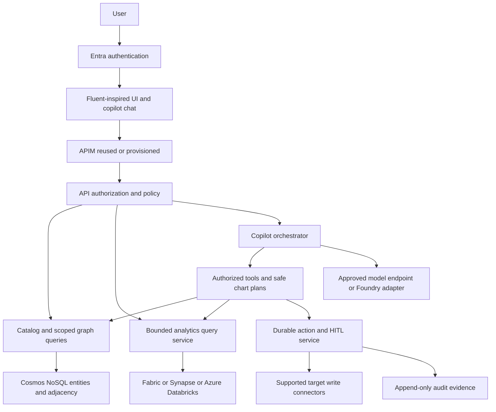
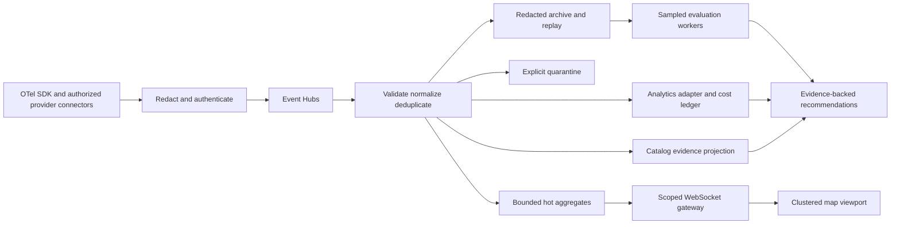
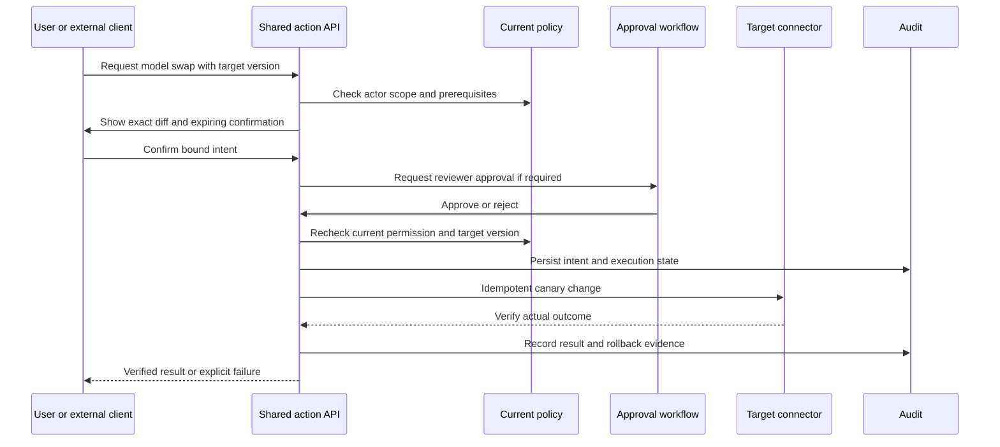
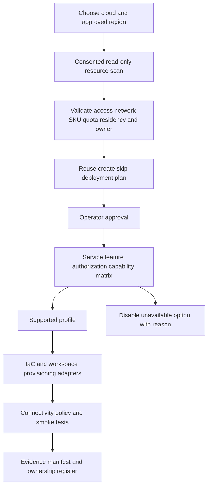
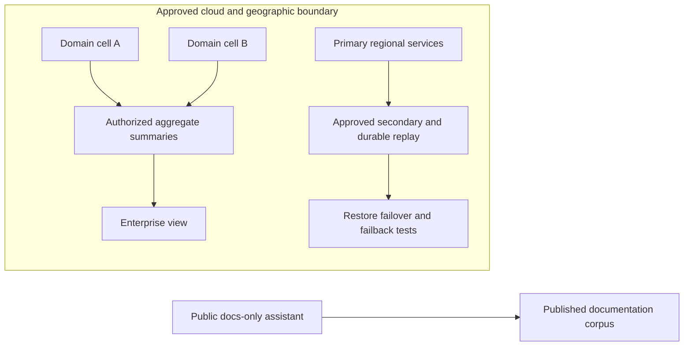

# NeuroSphere — Architecture baseline v1.1
## Decisions and retained trade-offs
Azure Commercial/Government are deployment boundaries; third-party providers are approved connector targets. Start modular API plus ingestion/action/evaluation workers. API and domain contracts are independent of analytics vendor or optional managed agent orchestration.
| Layer | Baseline | Retained alternative / gate |
|---|---|---|
| Catalog/relationships | Cosmos DB NoSQL versioned documents and adjacency, bounded query service | Neo4j for justified deep graph workloads; residency/license/operations benchmark required. Gremlin considered but not baseline due traversal/partition limits. No unverified Cosmos PostgreSQL/Apache AGE dependency. |
| Analytics | Deployment-selected Fabric, Synapse or Azure Databricks | Capability manifests and equivalent query results; availability/security approval per cloud/region/feature. ClickHouse is historical, not a default. |
| Events | Azure Event Hubs plus durable quarantine and redacted archive | Local fixture transport; standalone Kafka/PubSub/Kinesis are historical comparisons, not supported hosting promises. |
| Search | Azure AI Search with server-side scope filters | Offline fixture index; Pinecone/Qdrant are historical options, not required deployment dependencies. |
| Copilot | Application-owned authorized query/action tools; approved model endpoint | Foundry Agent Service adapter only for validated features/regions; same action contract on fallback. |
| Compute | AKS enterprise, App Service smaller supported profile | No assumption App Service runs Helm; same container/domain code, different IaC modules. |
Operational graph stores entities/edge evidence references and rollups; raw events/traces/cost ledger live outside it. Indexes and projections are rebuildable. Domain/shard partitioning, precomputed cross-domain summaries and bounded fan-out avoid whole-enterprise traversal on each request.
## 1. Component and trust-boundary flow

## 2. Telemetry projections and live view

Offset/checkpoint advancement follows durable acceptance or quarantine. Separate sink checkpoints/idempotent projection reconcile partial writes; no fictional cross-store transaction. Source billing freshness differs from instrumented trace freshness. Hot aggregates remain operational if batch analytics is delayed; UI shows lag and coverage.
## 3. Governed action from chat, button or MCP

## 4. Deployment intelligence and sovereign profiles

Commercial and Government deploy separate identity endpoints, model/search/storage/event services and analytics resources; no automatic cross-cloud data flow. Fabric/Synapse/Databricks choices are evaluated individually. Resource discovery is visibility-limited, not an unrestricted tenant inventory.
## 5. Federation and disaster recovery

Domain cells publish permitted aggregates, not unrestricted identities/prompts. Replication locations require approval and actual service support; paired-region assumptions are insufficient. Event Hubs metadata geo-DR does not replicate event data or RBAC. Data geo-replication availability/tier must be checked; otherwise implement approved archive/replay strategy and publish measured RPO limitations. Foundry does not supply automatic application failover.
## 6. Data model and query safety
Entities carry canonical ID, customer/domain/cloud, version, lifecycle, owner, classification and residency. Models include deployment/version/modality/context/tool capability and price-reference metadata. Relations carry asserted/inferred/curated status, confidence/provenance, validity, evidence references and override lock. Runs/spans are referenced rather than indefinitely replicated into graph nodes.
GraphQuery supports scoped get/search/neighbors/bounded impact paths; RecommendationCompute handles analytical graph/similarity jobs away from the interactive path. Copilot uses structured tools rather than unrestricted Cypher/SQL. Search and push paths enforce the same policy as REST.
The five Mermaid sources above are the diagram of record. They were rendered and parser-validated on 2026-10-08 to docs/diagrams/01..05-*.svg (gate G10 closed). Re-render after any source change; PRP-00 adds the script and CI check that keeps the SVGs in sync.
