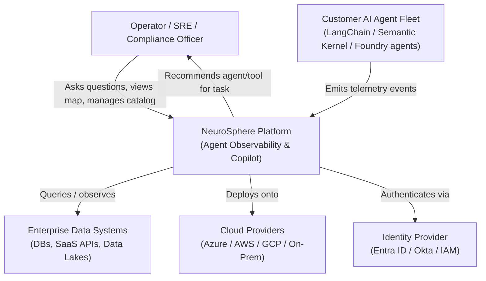
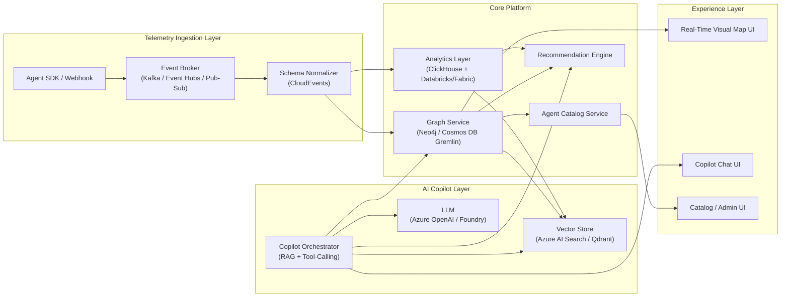
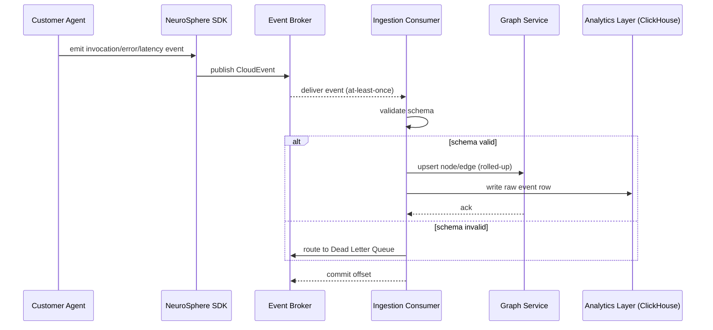
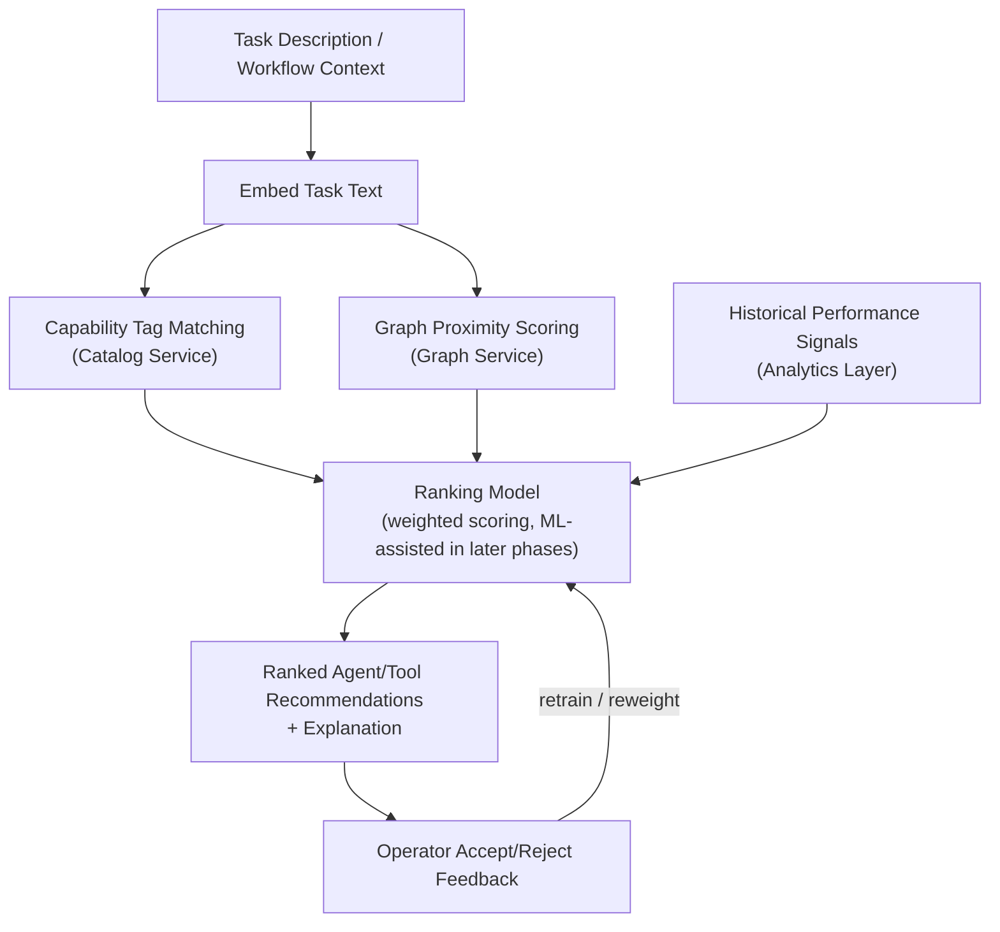
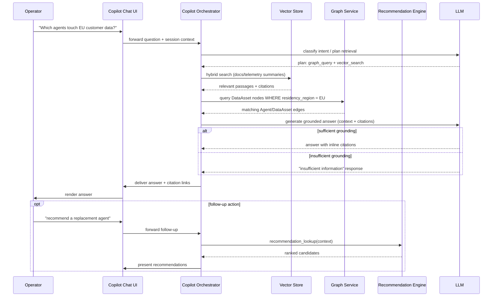
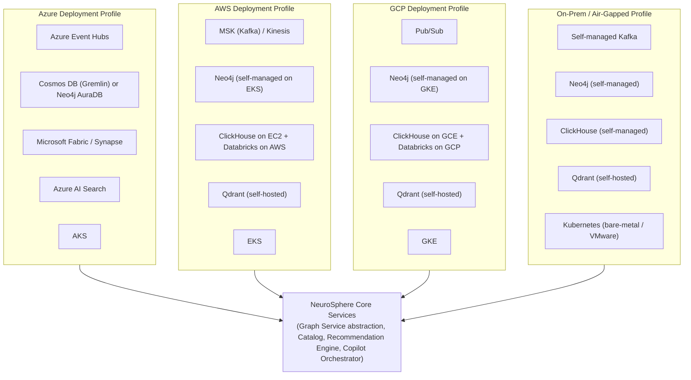
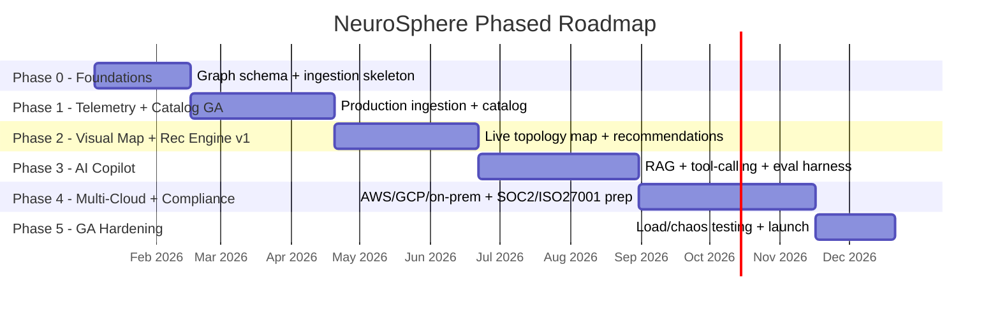

# NeuroSphere — Architecture Diagrams

All diagrams below are valid Mermaid syntax (verified for balanced brackets/quotes and correct directive keywords).

## 1. C4-Style System Context Diagram

## 2. Component Diagram

## 3. Event-Driven Telemetry Pipeline Sequence Diagram

## 4. Recommendation Engine Data Flow

## 5. AI Copilot Request/Response Sequence (Retrieval + Tool Calls)

## 6. Multi-Cloud Deployment Topology

## 7. Phased Roadmap (Gantt Chart)

---
*All architecture/technology choices reflected here (Neo4j, Cosmos DB Gremlin, ClickHouse, Databricks, Fabric, Azure AI Search, Qdrant, Kafka, Event Hubs, Pub/Sub) are grounded in the cited sources in NeuroSphere-PRP.md. Framework choice for the Copilot Orchestrator (Azure AI Foundry Agent Service vs. Semantic Kernel vs. LangGraph) is marked ⚠ needs verification pending a dedicated bake-off.*
